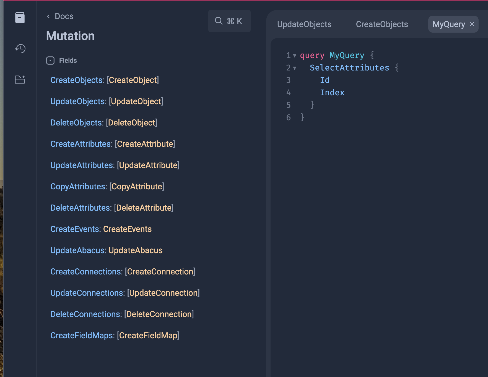
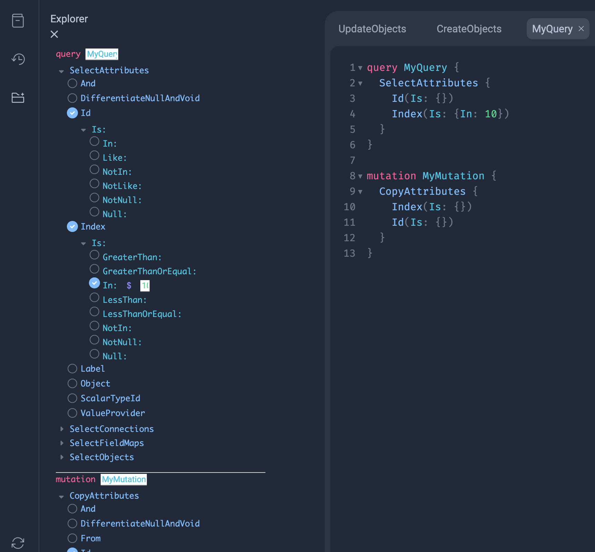

The Developer Kit is a collection of tools and information to get you quickly started using the RVM and it's applications.

* The GitHub repository is located [here](https://github.com/QuantafireIO/DeveloperKit).
* The GitHub Pages site is located [here](https://quantafireio.github.io/DeveloperKit/).

## Insomnia Collection

The Insomnia Collection is a collection of RadioGraphQL Behavior examples to help you get going.

* Version 2024.04.01 can be found [here](Insomnia_2024-04-01.json)
* Version 2024.03.07 can be found [here](Insomnia_2024-03-07.json)

## RadioGraphQL Console

The RadioGraphQL Console is a tool that can be used as a friendly way to explore the Schemas and Behaviors that are available on an RVM.

The pattern for selecting an RVM, and a Schema to use with the Console is as follows,

```
https://console.quantafire.io/{RVM Id}/{Vendor}/{Schema}
```

So, if I wanted to use the Console with an RVM that has an Id of `065e9de5-d9e1-79bf-8000-6c020c141317`, and I wanted to explore the Abacus Schema (Application) the URL would be,

```
https://console.quantafire.io/065e9de5-d9e1-79bf-8000-6c020c141317/Quantafire/Abacus
```

The Console is built using [graphiql](https://github.com/graphql/graphiql) and has Documentation and Explorer views.



## Accessing an RVM

The pattern for accessing an RVM is similar to the Console and is as follows,

```
https://rvm.quantafire.io/{RVM Id}/{Vendor}/{Schema}
```

So, if I wanted to access an RVM with an Id of `065e9de5-d9e1-79bf-8000-6c020c141317`, and I wanted to use the Abacus Schema (Application) the URL would be,

```
https://rvm.quantafire.io/065e9de5-d9e1-79bf-8000-6c020c141317/Quantafire/Abacus
```

## Product Site

The Product site has additional documentation and context about the various Behaviors in each Schema, as well as more detailed information about the RVM, but it is not necessary to get started.

The Product Site can be reached at

```
https://www.quantafire.io/
```

Your username is your first name (lower case) and your password is your phone number (as a string of numbers without any other characters).
